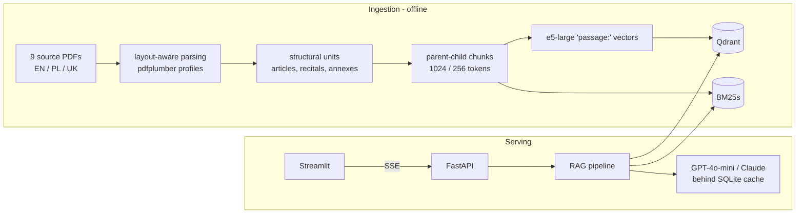

# Multilingual RAG — EU / Polish / Ukrainian AI & Data-Protection Law

Ask a legal-compliance question in English, Polish, or Ukrainian and get an
answer **in your language, cited down to the article** — even when the answer
lives in a statute written in another language. Built for the realistic case
of, say, a Ukrainian founder running a company in Poland who needs to know
what the EU AI Act, GDPR/RODO, Polish labour law, and Ukrainian data-protection
law each demand — without reading four legal systems in three languages.

**Stack:** Qdrant + BM25s hybrid retrieval (RRF) · `multilingual-e5-large`
embeddings · cross-encoder reranking · parent-child chunking · HyDE ·
FastAPI (SSE) · Streamlit · ragas evaluation · Docker Compose.

## Architecture



### Retrieval pipeline

```
User query (any language)
        │
        ▼
  Language detection (lingua)
        │
        ▼
  [optional] HyDE — hypothetical excerpt, embedded as passage
        │
   ┌────┴────┐
   │         │
 Dense     BM25
retrieval  retrieval
(Qdrant)   (BM25s)
   │         │
   └────┬────┘
        │  Reciprocal Rank Fusion
        ▼
  Cross-encoder reranking (top 20 → 5)
        │
        ▼
  Parent-chunk context assembly + source metadata
        │
        ▼
  LLM generation (language-aware prompt, cache-first)
        │
        ▼
  Streamed response + citations in the query's language
```

## Corpus

| Document | Language | Jurisdiction | Type | Units indexed |
|---|---|---|---|---|
| EU AI Act — Regulation (EU) 2024/1689 | EN | EU | regulation | 180 recitals · 113 articles · 13 annexes |
| GDPR — Regulation (EU) 2016/679 | EN | EU | regulation | 173 recitals · 99 articles |
| RODO — official Polish GDPR text | PL | EU | regulation | 173 recitals · 99 articles |
| Digital Services Act — Regulation (EU) 2022/2065 | EN | EU | regulation | 156 recitals · 93 articles |
| Ustawa o ochronie danych osobowych (2018) | PL | PL | act | 176 articles |
| Kodeks pracy (Labour Code, consolidated 2026) | PL | PL | act | 480 articles |
| Закон «Про захист персональних даних» № 2297-VI | UK | UA | act | 30 articles |
| EDPB Opinion 28/2024 on AI models (PL, *unofficial translation*) | PL | EU | guidance | 132 numbered paragraphs |
| UODO strategic report on AI use in organisations | PL | PL | guidance | 1 document |

3,710 child chunks (1,553 EN / 2,012 PL / 145 UK) over 1,986 parent chunks.
Every chunk carries provenance: source, jurisdiction, language, article
reference, official/unofficial flag, source URL, ingestion date. Unofficial
translations are labeled as such in the LLM context and the UI.

## Evaluation

57-item hand-built golden set (en/pl/uk × simple / cross-lingual / multi-hop),
scored with deterministic retrieval metrics — full tables in
[docs/eval/results.md](docs/eval/results.md), interpretation in
[docs/eval/analysis.md](docs/eval/analysis.md):

| Configuration | unit hit@5 | MRR | retrieval p95 |
|---|---|---|---|
| dense only | 0.727 | 0.544 | 132 ms |
| dense + BM25 (RRF) | 0.673 | 0.487 | 101 ms |
| hybrid + multilingual rerank | 0.782 | 0.675 | 8,480 ms |
| hybrid + rerank + HyDE | *needs LLM key* | — | — |

An initial evaluation exposed that the English-only `ms-marco-MiniLM`
cross-encoder removed correct foreign-language passages from cross-lingual
results. The production pipeline now uses the multilingual
`BAAI/bge-reranker-v2-m3`; current measurements are recorded in
[docs/eval/results.md](docs/eval/results.md). ragas generation metrics
(faithfulness, answer relevancy, …) are wired in and run with
`uv run python -m src.eval.run_eval --ragas` once an LLM key is configured.

## Setup

```bash
git clone <repo-url> && cd multilingual-rag
cp .env.example .env   # add OPENAI_API_KEY (optional: retrieval works without)
docker compose up
```

First start bootstraps everything automatically (parses PDFs, chunks, embeds
~10–20 min on CPU, cached afterwards). Then open <http://localhost:8501>.

Local development without Docker:

```bash
uv sync
uv run python -m src.bootstrap                 # parse + chunk + index (embedded Qdrant)
uv run uvicorn src.api.main:app --port 8000    # terminal 1
uv run streamlit run frontend/app.py           # terminal 2
uv run pytest                                  # 47 tests
```

Without an OpenAI or Anthropic API key, the app automatically runs in
**retrieval-only mode**: queries still execute language detection, hybrid
retrieval, and reranking, then show the most relevant source excerpts and
citations. Generated answers, translation, and HyDE require an LLM key.

## Example queries

Try these in the UI (also wired as one-click examples):

- 🇬🇧 *Which AI practices are prohibited under the AI Act?* → cites AI Act
  Article 5 (EN)
- 🇵🇱 *Jakie kary pieniężne przewiduje RODO za naruszenia?* → cites RODO
  Art. 83 (PL)
- 🇺🇦 *Які права має суб'єкт персональних даних?* → cites Закон № 2297-VI
  Стаття 8 (UK)
- 🇺🇦→🇬🇧 *Які системи штучного інтелекту заборонені в ЄС?* → a Ukrainian
  question answered from the **English** AI Act Article 5, citation kept in
  the source language — the colour-coded language badges in the sources panel
  make the cross-linguality visible at a glance.

## Project log

Built phase-by-phase per [docs/multilingual_rag_plan.md](docs/multilingual_rag_plan.md);
decisions in [docs/ADR.md](docs/ADR.md); PDF-layout findings in
[docs/ingestion_notes.md](docs/ingestion_notes.md); chunking rationale in
[notebooks/chunking_analysis.ipynb](notebooks/chunking_analysis.ipynb);
retrieval sanity checks in
[notebooks/retrieval_smoke_test.ipynb](notebooks/retrieval_smoke_test.ipynb);
phase status reports in [docs/phases/](docs/phases/).

## What I would do with more time

- **Language-aware RRF weighting** — BM25 contributes only same-language
  candidates, so its fusion weight should drop when the query targets
  other-language documents.
- **Distil the multilingual reranker** — `bge-reranker-v2-m3` fixes the
  cross-lingual relevance failure but is the dominant local retrieval cost.
- **Paragraph-level citations** (Art. 6 ust. 1 lit. f / Стаття 8 ч. 2) —
  metadata currently stops at article level; statutory paragraph anchors
  would make citations directly pasteable into legal work.
